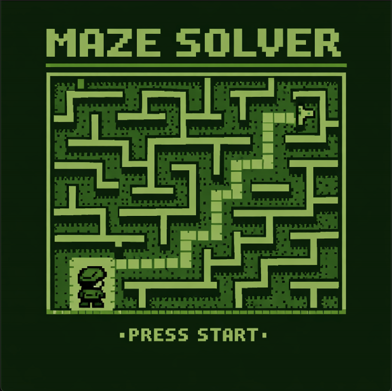
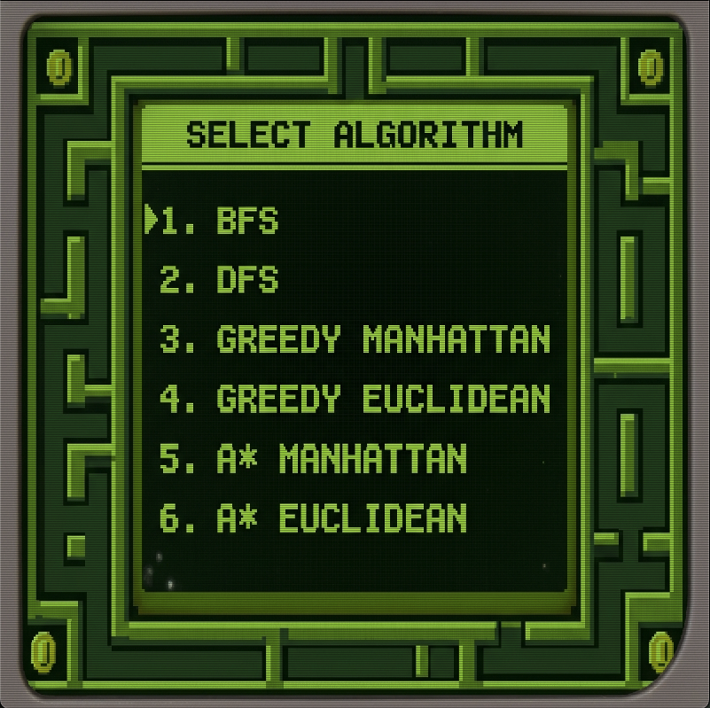
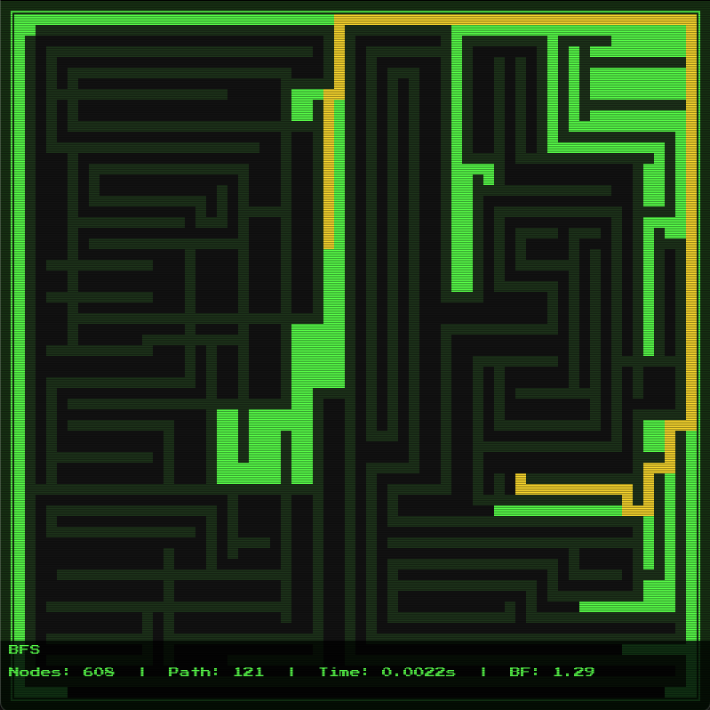

# Maze Solver

Proyecto para comparar cuatro algoritmos de búsqueda aplicados a la resolución de laberintos. Dos no informados (BFS y DFS) y dos informados (Greedy y A*), estos últimos evaluados con dos heurísticas distintas: Manhattan y Euclidiana.

---

## Algoritmos

### No informados

**DFS — Depth First Search**
Toma una rama del árbol de búsqueda y baja hasta encontrar la hoja. Cuando llega a ese punto, sube al nodo padre y se va al siguiente nodo hijo sin explorar. Este comportamiento de "último en entrar, primero en salir" es precisamente por lo que utiliza una cola **LIFO**.

**BFS — Breadth First Search**
En contraste con DFS, BFS explora nivel por nivel del árbol, comenzando por el nodo hijo más a la izquierda y desplazándose hacia la derecha. Al terminar un nivel, baja uno más hasta quedarse sin nodos por explorar. Es por esto que utiliza una cola **FIFO**. 

### Informados

Los algoritmos informados utilizan una **heurística** — una regla que nos ayuda a estimar qué nodo presenta el mejor resultado sin tener que recorrer todos los caminos posibles.

**Greedy Best-First Search**
Basándose únicamente en la heurística, analiza sus opciones y toma el nodo con el mejor valor en relación al objetivo. No considera cuánto costó llegar hasta el nodo actual, solo qué tan cerca parece estar de la meta.

**A* (A estrella)**
A diferencia de Greedy, A* toma en consideración dos cosas para decidir a qué nodo moverse: el **costo acumulado** (la suma de los pasos tomados desde el inicio) junto con la **heurística**. La suma de ambos forma el valor de decisión — quien tenga el valor más bajo es el nodo ganador, dado que nos interesa acortar distancias. Esto le permite garantizar el camino óptimo siempre que la heurística sea admisible.

### Heurísticas

**Manhattan**
Calcula cuánto hay que moverse en X y en Y para llegar al destino. Ideal para grids con movimiento en 4 direcciones.
```
|row_actual - row_goal| + |col_actual - col_goal|
```

**Euclidiana**
Utiliza el teorema de Pitágoras para encontrar la distancia en línea recta entre el nodo actual y el objetivo.
```
sqrt((row_actual - row_goal)² + (col_actual - col_goal)²)
```

---

## Visualización

Para visualizar los algoritmos en tiempo real, corre:

```bash
python main.py
```

### Pantalla de inicio

Al iniciar la aplicación se presenta una pantalla de inicio. Presiona **SPACE** o **ENTER** para continuar al menú.



### Menú de selección

En el menú, presiona el número correspondiente al algoritmo que deseas ejecutar:

| Tecla | Algoritmo |
|---|---|
| 1 | BFS |
| 2 | DFS |
| 3 | Greedy Manhattan |
| 4 | Greedy Euclidean |
| 5 | A* Manhattan |
| 6 | A* Euclidean |

Presiona **ESC** para volver a la pantalla de inicio.



### Resolución en tiempo real

El algoritmo seleccionado resolverá el laberinto animando cada nodo explorado. Al terminar, se muestra el camino solución y las métricas finales: nodos explorados, largo del camino, tiempo de ejecución y branching factor. Presiona **ESC** para volver al menú.



---

## Herramientas adicionales

### Laberinto con punto de partida aleatorio

```bash
python main_random.py
```

Genera un nuevo laberinto con un punto de partida aleatorio. Para garantizar que el punto elegido sea válido, se verifica la conectividad con el goal utilizando BFS — si no retorna resultado, se prueba con otra celda. El laberinto generado se guarda en el root como `HHMMSS_maze.txt`. Para usarlo, actualiza `MAZE_FILE` en `main.py` con el nombre del archivo generado.

### Exportar métricas

```bash
python main_results.py
```

Toma el `MAZE_FILE` definido en el archivo, corre los 6 algoritmos y exporta los resultados como:

```
nombremaze_RESULTS.csv
```

Con las siguientes columnas:

| algorithm | path_length | nodes_explored | execution_time | branching_factor |
|---|---|---|---|---|
